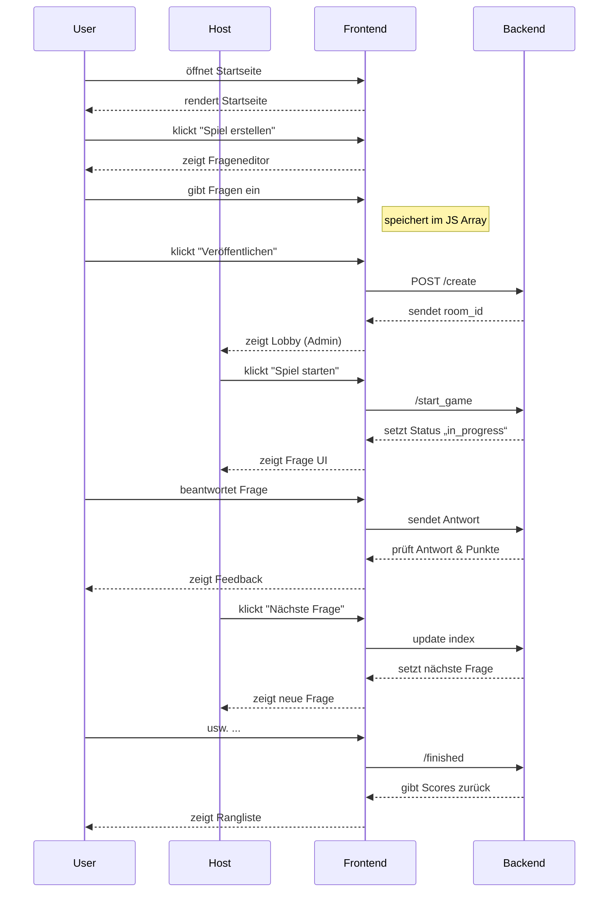

```mermaid
sequenceDiagram
    participant User
    participant Host
    participant Frontend
    participant Backend

    User->>Frontend: öffnet Startseite
    Frontend-->>User: rendert Startseite

    User->>Frontend: klickt "Spiel erstellen"
    Frontend-->>User: zeigt Frageneditor

    User->>Frontend: gibt Fragen ein
    Note right of Frontend: speichert im JS Array

    User->>Frontend: klickt "Veröffentlichen"
    Frontend->>Backend: POST /create
    Backend-->>Frontend: sendet room_id
    Frontend-->>Host: zeigt Lobby (Admin)

    Host->>Frontend: klickt "Spiel starten"
    Frontend->>Backend: /start_game
    Backend-->>Frontend: setzt Status „in_progress“

    Frontend-->>Host: zeigt Frage UI
    User->>Frontend: beantwortet Frage
    Frontend->>Backend: sendet Antwort
    Backend-->>Frontend: prüft Antwort & Punkte
    Frontend-->>User: zeigt Feedback

    Host->>Frontend: klickt "Nächste Frage"
    Frontend->>Backend: update index
    Backend-->>Frontend: setzt nächste Frage
    Frontend-->>Host: zeigt neue Frage

    User->>Frontend: usw. ...

    Frontend->>Backend: /finished
    Backend-->>Frontend: gibt Scores zurück
    Frontend-->>User: zeigt Rangliste
```
```
