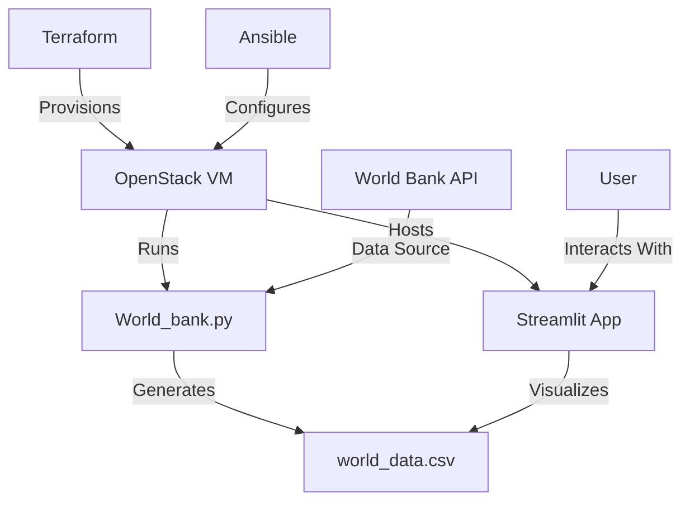
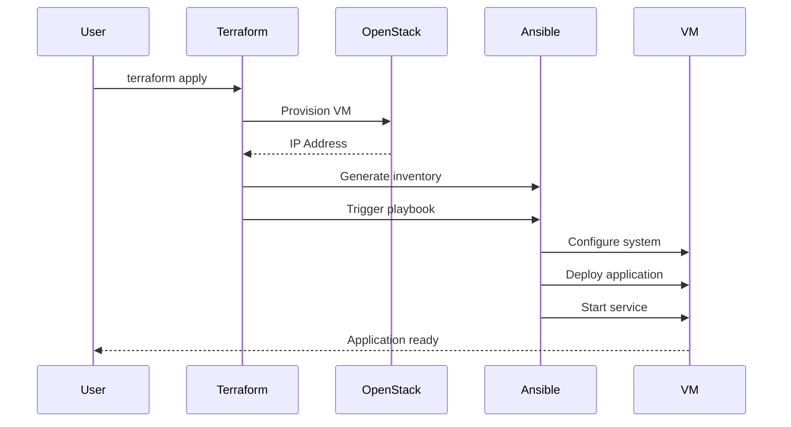

# Exercise 2 Configuration Management and Deployment 
This project demonstrates a complete CI/CD pipeline for deploying a Streamlit application that visualizes World Bank GDP data using OpenStack cloud infrastructure. The solution features:

- Automated infrastructure provisioning with Terraform

- Application deployment and configuration with Ansible

- Data pipeline that fetches GDP data from World Bank API

- Interactive Streamlit dashboard for data visualization

- Git-based version control for both infrastructure and application code (incl. Rollback)

The application consists of:

``World_bank.py``: Fetches GDP data from World Bank API and saves to CSV

``main.py``: Streamlit dashboard for visualizing GDP data

``requirements.txt``: Python dependencies



### Prerequisites (for Windows User)

1. Install Wsl (Documentation for Windows): https://learn.microsoft.com/en-us/windows/wsl/install

2. Install ansible on your wsl Ubuntu Terminal with:
   ```hcl
   sudo apt update && sudo apt install -y ansible
   ```
3. Install Terraform on your wsl Ubuntu Terminal with:
      ```hcl
   curl -fsSL https://apt.releases.hashicorp.com/gpg | sudo gpg --dearmor -o /usr/share/keyrings/hashicorp-archive-keyring.gpg
   ```
      ```hcl
   echo "deb [signed-by=/usr/share/keyrings/hashicorp-archive-keyring.gpg] https://apt.releases.hashicorp.com $(lsb_release -cs) main" | sudo tee /etc/apt/sources.list.d/hashicorp.list
   ```
      ```hcl
      sudo apt update && sudo apt install -y terraform
   ```
### Deployment Workflow (Git-based version control for both infrastructure and application code (incl. Rollback))
The deployment process is a fully automated pipeline orchestrated through Terraform and Ansible, designed to provision infrastructure and deploy the application in a single command. When the user executes terraform apply, the following sequence of events occurs:

**Phase 1: Infrastructure Provisioning**

Terraform initiates communication with the OpenStack API using the credentials specified in the provider configuration. It requests the creation of a compute instance named ``rk-demo-bigdata`` (or ``rk-demo-bigdata-v2`` when using version 2). The virtual machine is configured with Ubuntu 24.04, allocated a cb1.small compute flavor, and attached to the ``provider_912`` network. Terraform waits until the instance becomes fully operational and obtains its assigned IPv4 address from OpenStack's networking service.

**Phase 2: Dynamic Inventory Generation**

Once the instance is running, Terraform generates two critical files in the local directory:

``inventory.ini`` - An Ansible-compatible inventory file containing the instance's IP address, SSH user (ubuntu), and path to the private SSH key

``openstack-inventory.txt`` - A simple text record of the IP address for reference

**Phase 3: Ansible Automation Trigger**

The null_resource with its local-exec provisioner initiates the Ansible playbook execution. The timestamp-based trigger (``always_run = timestamp()``) ensures this step runs on every Terraform apply, regardless of whether infrastructure changes occurred. Ansible receives the generated inventory file and begins connecting to the target VM via SSH.

**Phase 4: System Configuration & Application Deployment**

Ansible executes the tasks defined in ``deploy_app.yml`` in sequence:

Updates the package manager cache and installs Python runtime, pip, virtualenv, and Git dependencies

Creates a dedicated system user (``app_user``) and application directory (``/var/opt``)

Copies the version-specific application code (based on the ``app_version`` variable) from the local ``app_versions`` directory to the VM

Creates a Python virtual environment and installs dependencies from requirements.txt

Configures a systemd service unit to manage the application lifecycle

Reloads the systemd daemon and starts the application service

**Phase 5: Data Pipeline Initialization**

The World_bank.py script executes automatically upon service start. It requests GDP data from the World Bank API (http://api.worldbank.org/v2/country/all/indicator/NY.GDP.MKTP.CD), processes the JSON response, and generates ``world_data.csv`` with country names, years, and GDP values. This dataset becomes the foundation for the Streamlit visualization.

**Phase 6: Application Startup**

The systemd service starts the Streamlit application (``main.py``), which begins serving the dashboard on port 5500. The application loads the generated CSV data and presents an interactive interface allowing users to:

Visualize GDP trends across countries and years

Toggle between bar charts and scatter plot visualizations

Compare multiple countries (version 2 feature)

Download filtered datasets (version 2 feature)

**Final State Verification**

Terraform completes its execution after confirming successful Ansible provisioning. The Streamlit application becomes accessible at ``http://<instance_ip>:5500`` where users can immediately interact with the visualization. The entire process—from infrastructure provisioning to application availability—typically completes within 5-7 minutes depending on API response times and network conditions.

**Version-Specific Workflow Notes**

When switching between versions using Git tags:

The git checkout v2 command updates both infrastructure definitions (VM name) and application code

Terraform destroys the previous VM and provisions a new instance with updated naming

Ansible deploys the enhanced v2 application features including data export and comparison tools

The timestamp trigger ensures the latest playbook always executes after infrastructure changes

This integrated workflow exemplifies modern Infrastructure-as-Code practices where infrastructure provisioning, configuration management, and application deployment converge into a single automated process. The timestamp trigger guarantees consistent deployment behavior regardless of whether infrastructure resources were modified or not, ensuring the latest application version always runs on the provisioned infrastructure.

